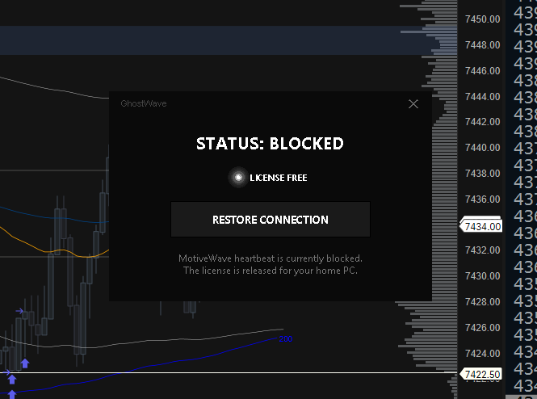

<div align="center">
  
  <h1>GhostWave</h1>
</div>

dm syskey1843 on discord if you need help

App to quickly block Motivewave's heartbeat and emulate the "license no longer in use" api request, allowing you to use your license on another machine without having to close the app on your current one.

or share ur license with a friend and use it at the same time as them.

## How It Works

MotiveWave pings its licensing server every 60 seconds. GhostWave blocks that heartbeat by editing your Windows `hosts` file and fires a license release request directly to MotiveWave's API. The server thinks your PC went offline and frees the license instantly. MotiveWave keeps running fine in the background on the blocked machine.

## First-Time Setup

When you run GhostWave for the first time (or on a new machine), it needs to capture your unique license credentials. This is fully automated:

1. **Run GhostWave** — it will show `STATUS: SETUP REQUIRED` and start a local proxy in the background.
2. **GhostWave patches MotiveWave's `startup.ini`** to route Java traffic through the proxy (MotiveWave ignores Windows proxy settings, so GhostWave injects JVM arguments directly).
3. **Open MotiveWave, then close it.** When MotiveWave shuts down it sends a license release request — GhostWave intercepts it and saves your `profile_id` and `machine_id` to a local `config.json`.
4. **Done.** GhostWave restores the original `startup.ini`, kills the proxy, and transitions to the main interface. You never need to do this again.

> **Requirements for setup:** [mitmproxy](https://mitmproxy.org/) must be installed and `mitmdump` available in your system PATH.

## Usage

1. Download `GhostWave.exe` from the `release` folder.
2. Right-click → **Run as Administrator** (required for editing the Windows hosts file).
3. Complete the one-time setup if prompted (see above).
4. Click **Drop Connection** to block the heartbeat and release your license.
5. Click **Restore Connection** whenever you want to reconnect.

## Historical Data Downloader

GhostWave includes a built-in downloader for historical market data. Pull bar and tick data straight from MotiveWave's S3 servers — no login required.

- Enter the symbol (e.g. `ENQU6.CME`)
- Select data type: **Bar**, **Tick**, or **All**
- Click **Download**

Files are saved to a `historical_data` folder next to the executable.

You can also use the standalone CLI script:

```bash
# List available data for a symbol
python src/data_downloader.py ENQU6.CME --list

# Download all data
python src/data_downloader.py ENQU6.CME

# Download only bar data
python src/data_downloader.py ENQU6.CME --type bar

# Download only tick data
python src/data_downloader.py ENQU6.CME --type tick
```

## Build from Source

```bash
pip install pyinstaller
pyinstaller --onefile --windowed --uac-admin --name "GhostWave" --icon "ghostwave.ico" src/mw_killswitch.py
```

## Preview


